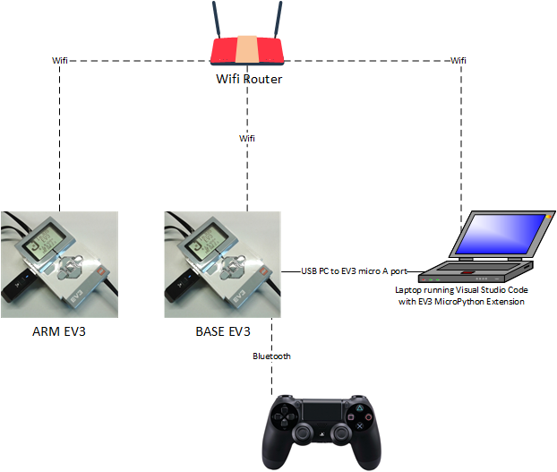

# EV3-Lego-Robotic-Arm
This repository is original from the Capstone project of Nino Guba. The project description can be found here: https://rebrickable.com/mocs/MOC-52151/gubsters/six-axis-6dof-robotic-arm-with-interchangeable-end-effectors/

The system uses two Mindstorm EV3 bricks to operate 8 total motors. The Two EV3 bricks are daisy chained using WiFi, where the BASE brick runs the application and the ARM base runs an RPYc server to receive commands from the BASE brick.

This repository contains two different applications that can be loaded into the Base EV3:
1) robot-arm.py  
The PS4 remote control can be used to manipulate the arm pose.  
2) remote_control.py  
Not sure yet what this does, but it looks like the arm will adjust its pose based on color and touch sensors.

## Connections
The following diagram shows the various components of the system and how they connect.


## Running the System
1) Connect Laptop to BASE EV3 using USB (connect to PC mini-A USB port on the EV3). The Laptop must have Visual Studio Code instaled with the EV3 MicroPython extension installed into Visual Studio Code.
This article steps 1-6 describe how to connect to enable the EV3 connection to the Laptop. The USB connection from the EV3 presents itself as a Wired Ethernet Connection in Linux and therefore must be added as a wired network connection: https://www.ev3dev.org/docs/tutorials/connecting-to-the-internet-via-usb/

2) Connect to the EV3 from EV3 MicroPython extension. This article section 2.3 describes how to connect to the EV3 from Visual Studio Code: https://assets.education.lego.com/v3/assets/blt293eea581807678a/bltb470b9ea6e38f8d4/5f8802fc4376310c19e33714/getting-started-with-micropython-v2_enus.pdf

3) Connect Laptop and the EV3s to WiFi. See this tutorial on connecting EV3 to Wifi: https://www.youtube.com/watch?v=nAUwe5fRsLw
Once the EV3s are connected to WiFi, go onto the UI of the ARM EV3 and determine its WiFi IP address so that it can be used in the BASE EV3 program to connect to the ARM EV3. The IP address can be retrieved from the same menu where the WiFi network was selected and connected.

4) Run the RPYC server on ARM3. ssh from the Laptop to the ARM EV3. Password is 'maker'.
````
ssh robot@<IP Address of ARM EV3>
````
Once logged into the EV3, run RPYC.
````
python3 `which rpyc_classic.py`
````
See this guide for details on the RPYC:  
https://ev3dev-lang.readthedocs.io/projects/python-ev3dev/en/ev3dev-jessie/rpyc.html

5) To connect the PS4 via bluetooth to BASE EV3, enable bluetooth scanning on the EV3. This is done by entering the Bluetooth menu and enable scanning. On the PS4, press both the Share and the PS buttons at the same time and hold until the from light on the PS4 begins to blink. On the BASE EV3, it should detect the Wireless Controller. Select Pair, and Connect. The devices should now be linked.

6) In the robot-arm.py source code, update the IP address of the ARM EV3 on this line to match that of the ARM EV3 device:
````
conn = rpyc.classic.connect('1.1.1.1') #change this IP address for your slave EV3 brick
````

7) Upload the updated work space to the BASE EV3 and Run from Visual Studio Code.

## Control Buttons
- L1: Turn Left  
- R1: Turn Right  
- Square: Roll Left  
- Circle: Roll Right  
- Triangle: Pitch Up  
- X: Pitch Down  
- L2: Spin Left  
- R2: Spin Right  
- R3: Grab (Toggle)
- Options: Reset  
- PS: Stop Running and Reset  


